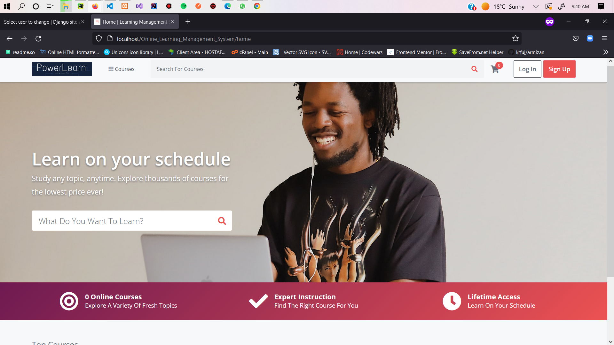
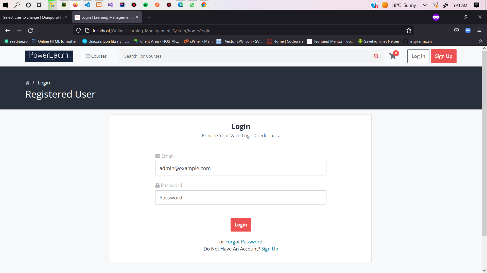
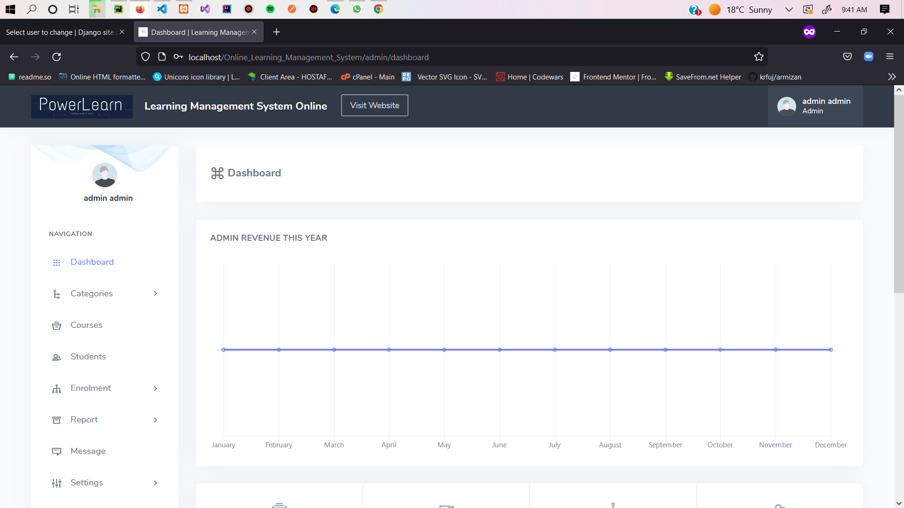
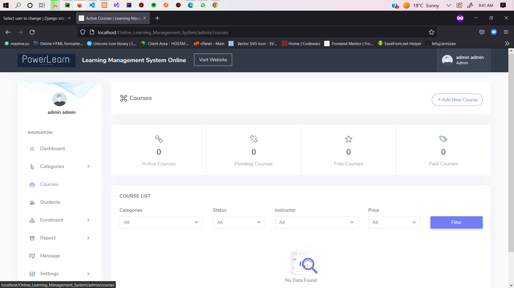

# School Management System

This is a LMS project by plp this project was done by Presley Sakwa and Hellen Musundi Ndubi.


## Features

##Available Features:

-Admin Panel
-Student Panel
-Teacher Panel
-Classroom Management
-Student Management
-Teacher Management
-Assign Class Teachers
-Assign Subjects
-Syllabus Management
-Download Syllabus
-Manage Study Materials
-Student Attendance Management

###Instructions: How to Run

"Online Learning Management System"

## Installation
````
Install project with XAMPP

1.XAMPP

2.Editor of choice

3. Download the zip file

4.Paste inside root directory/ where you install xammp local disk C: drive D: drive E: paste: (for xampp/htdocs, 

7. Open PHPMyAdmin (http://localhost/phpmyadmin)

8. Create a database with name dblms

6. Import dblms.sql file(given inside the zip package in SQL file folder)

7.Run the script http://localhost/plpFinalProject
````


**LOGIN DETAILS** 
````
for user create or student

Admin
user: admin@example.com
pass: admin

****** https://www.sakwa.co.ke/ ******
Visit my website*****
````

## Screenshots

these are screeenshots of the home homescreen on login the website 






## Badges

Add badges from somewhere like: [shields.io](https://shields.io/)

[](https://choosealicense.com/licenses/mit/)
[](https://opensource.org/licenses/)
[](http://www.gnu.org/licenses/agpl-3.0)


